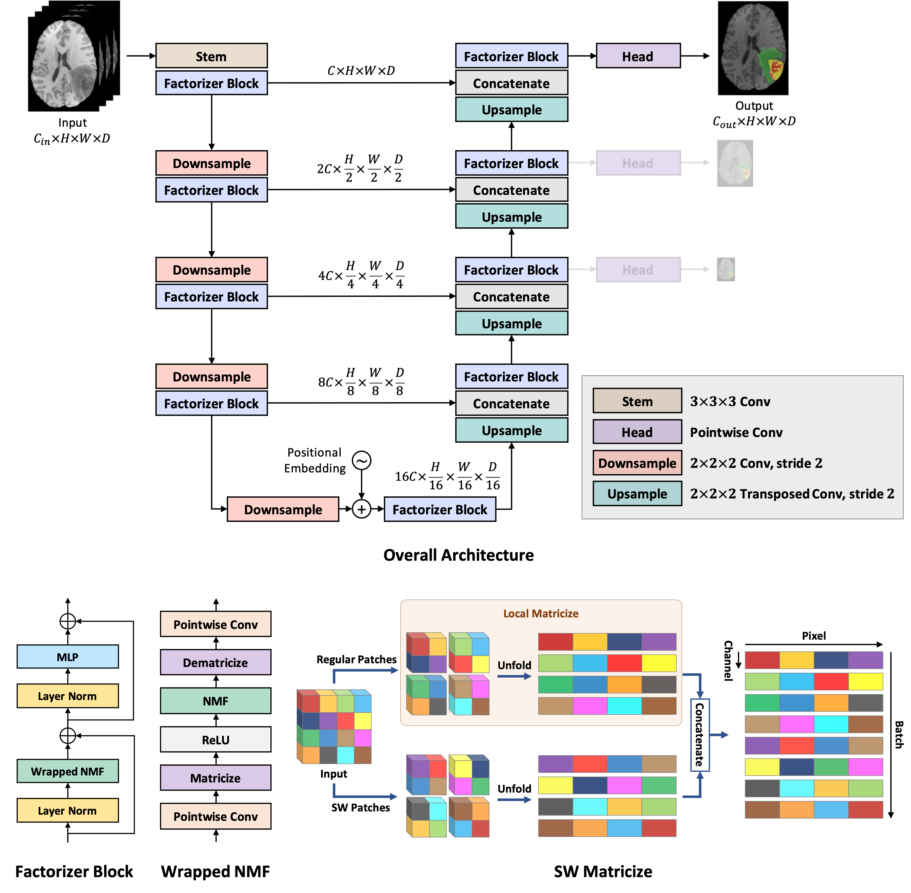

This repo is the official implementation of ["Factorizer: A Scalable Interpretable Approach to Context Modeling for Medical Image Segmentation"](https://arxiv.org/abs/2202.12295).


## Introduction

**Factorizer** leverages the power of low-rank matrix approximation to construct end-to-end deep models for medical image segmentation. Built upon differentiable matrix factorization layers and matricize operations, Factorizers with U-Shaped architectures can compete favorably with CNN and Transformer baselines in terms of accuracy, scalability, and interpretability. Details on the methods and results for brain tumor segmentation and stroke lesion segmentation can be found in our [paper](https://doi.org/10.1016/j.media.2022.102706).




## Installation

First make sure that you have already installed [PyTorch](https://pytorch.org/get-started/locally/) since the details on how to do this depend on whether you have a CPU, GPU, etc. Then, for installing the Factotizer package, do this:

```bash
$ pip install git+https://github.com/pashtari/factorizer.git
```


## Usage

Import required modules:

```python
import torch
from torch import nn
import factorizer as ft
```

**Nonnegative Matrix Factorization Layer**
```python
nmf = ft.NMF(size=(8, 512), rank=2, num_iters=5, init="uniform", solver="mu")

x = torch.rand((1, 8, 512), requires_grad=True)

y = nmf(x) # (1, 8, 512)

print(f"FLOPS = {nmf.flops}") # FLOPS per sample
```
    FLOPS = {'init': 0, 'decompose': 226240, 'reconstruct': 16384}

**Shifted Window Matricize**
```python
sw_matricize = ft.SWMatricize((None, 32, 128, 128, 128), head_dim=8, patch_size=8)

x = torch.rand((1, 32, 128, 128, 128), requires_grad=True)

y = sw_matricize(x)  # (8, 4096, 8, 512)

z = sw_matricize.inverse_forward(y)

torch.equal(x, z) # True
```

**Swin Factorizer Subblock (Wrapped NMF)**
```python
swin_wrapped_nmf = ft.FactorizerSubblock(
    in_channels = 32,
    out_channels = 32,
    spatial_size = (128, 128, 128),
    tensorize=(ft.SWMatricize, {"head_dim": 8, "patch_size": 8}),
    act=nn.ReLU,
    factorize=ft.NMF,
    rank=1,
    num_iters=5,
    init="uniform",
    solver="mu",
)

x = torch.rand((1, 32, 128, 128, 128), requires_grad=True)

y = swin_wrapped_nmf(x) # (1, 32, 128, 128, 128)
```

**Swin Factorizer Block**
```python
factorizer_block = ft.FactorizerBlock(
    channels=32,
    spatial_size=(128, 128, 128),
    nmf=(
        ft.FactorizerSubblock,
        {
            "tensorize": (ft.SWMatricize, {"head_dim": 8, "patch_size": 8}),
            "act": nn.ReLU,
            "factorize": ft.NMF,
            "rank": 1,
            "num_iters": 5,
            "num_grad_steps": None,
            "init": "uniform",
            "solver": "mu",
            "dropout": 0.1,
        },
    ),
    mlp=(ft.MLP, {"ratio": 2, "dropout": 0.1}),
)

x = torch.rand((1, 32, 128, 128, 128), requires_grad=True)

y = factorizer_block(x) # (1, 32, 128, 128, 128)
```

**Swin Factorizer Stage Block**
A stack of multiple Swin Factorizer blocks followed by a positional embedding layer, which can be used at each stage of a network after downsampling layers.

```python
factorizer_stage = ft.FactorizerStage(
    in_channels=32,
    out_channels=32,
    spatial_size=(128, 128, 128),
    depth=2,
    nmf=(
        ft.FactorizerSubblock,
        {
            "tensorize": (ft.SWMatricize, {"head_dim": 8, "patch_size": 8}),
            "act": nn.ReLU,
            "factorize": ft.NMF,
            "rank": 1,
            "num_iters": 5,
            "init": "uniform",
            "solver": "mu",
            "dropout": 0.1,
        },
    ),
    mlp=(ft.MLP, {"ratio": 2, "dropout": 0.1}),
)

x = torch.rand((1, 32, 128, 128, 128), requires_grad=True)

y = factorizer_stage(x) # (1, 32, 128, 128, 128)
```

**Swin Factorizer for Segmentation**
```python
swin_factorizer = ft.SegmentationFactorizer(
    in_channels=4,
    out_channels=3,
    spatial_size=(128, 128, 128),
    encoder_depth=(1, 1, 1, 1, 1),
    encoder_width=(32, 64, 128, 256, 512),
    strides=(1, 2, 2, 2, 2),
    decoder_depth=(1, 1, 1, 1),
    stem=(nn.Conv3d, {"kernel_size": 3, "padding": 1, "bias": False},),
    downsample=(nn.Conv3d, {"kernel_size": 2, "bias": False}),
    upsample=(nn.ConvTranspose3d, {"kernel_size": 2}),
    head=(nn.Conv3d, {"kernel_size": 1}),
    num_deep_supr=3,
    dropout=0.1,
    nmf=(
        ft.FactorizerSubblock,
        {
            "tensorize": (ft.SWMatricize, {"head_dim": 8, "patch_size": 8}),
            "act": nn.ReLU,
            "factorize": ft.NMF,
            "rank": 1,
            "num_iters": 5,
            "init": "uniform",
            "solver": "hals",
            "dropout": 0.1,
        },
    ),
    mlp=(ft.MLP, {"ratio": 2, "dropout": 0.1}),
)

x = torch.rand((1, 4, 128, 128, 128))

y = swin_factorizer(x) # len(y) = 3

y[0].shape, y[1].shape, y[2].shape
```

    (torch.Size([1, 3, 128, 128, 128]),
    torch.Size([1, 3, 64, 64, 64]),
    torch.Size([1, 3, 32, 32, 32]))


## License

This repository is released under the Apache 2.0 license as found in the [LICENSE](LICENSE) file.


## Citation

If you use this code for a paper, please cite:

```
@article{ashtari2022factorizer,
      title={Factorizer: A Scalable Interpretable Approach to Context Modeling for Medical Image Segmentation}, 
      author={Pooya Ashtari and Diana Sima and Lieven De Lathauwer and Dominique Sappey-Marinierd and Frederik Maes and Sabine Van Huffel},
      year={2022},
      eprint={2202.12295},
      archivePrefix={arXiv},
      primaryClass={eess.IV}
}
```


## Contact

This repo is currently maintained by Pooya Ashtari ([@pashtari](https://github.com/pashtari)).